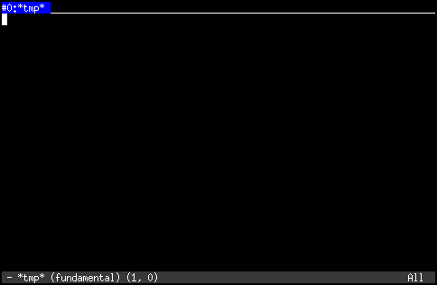
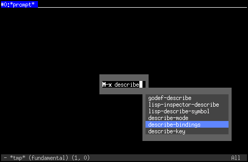
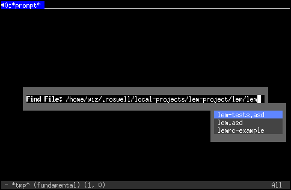
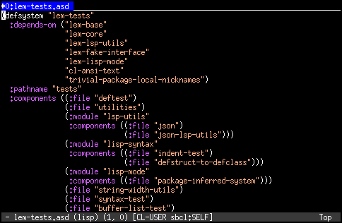
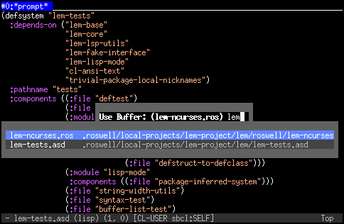
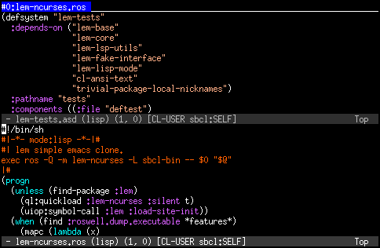
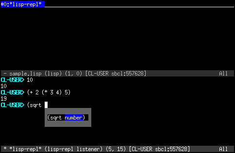

# テキストエディタ「Lem」

**Lem** はCommon Lispによって実装されたテキストエディタです。
Common Lispの開発環境がデフォルトで組込まれており、Lem自体もまたCommon Lispにより拡張可能です。

本書の著者の何人かはCommon Lispでの開発にLemを実用しており、Common Lispの開発環境として一定の実績があります。
また、Common Lisp以外のプログラミング言語サポートも徐々に追加されています。
デフォルトの操作体系はEmacsと似たものになっており、vi (Vim)モードも用意されています。

本章では、3章以降で必要とされるLemの基本操作と、Common Lispの開発に関連した機能を紹介します。
Lemの用語や拡張機能の実装方法などのより詳細な解説については7章 「詳解Lem」を参照してください。

## Lemのインストール

Lemの最新版は以下のようにRoswellからインストールできます。Roswellの詳細については1章を参照してください。

```
$ ros install lem-project/lem
```

Lemは256色表示をサポートしたターミナルエミュレータ上で実行することを想定しています。
Linuxのターミナルの場合はデフォルトでは8色表示になっている事が多いので、 `~/.bashrc`などで以下のように`TERM`環境変数を明に設定しておくとよいでしょう。

```
$ export TERM=xterm-256color
```

## 起動と終了

コマンドラインからLemを起動するには`lem`コマンドを使用します。
1章で解説したように、LemをRoswellからインストールした場合、`~/.roswell/bin`以下にLemの実行可能ファイルができます。
`PATH`環境変数にこのディレクトリを含むように設定しておくと、以下のようにLemを起動できます。

```
$ lem

# Lemの起動と同時にファイルを開く場合
$ lem <ファイル名>
```

初回起動時はLemのビルドを行うので多少時間がかかりますが、次回以降はコンパイル済みのLispイメージをロードするだけなので瞬時に起動するようになります。

Lemのビルドのためには `ncurses` というライブラリが必要です。もしライブラリが見つからずにLemのビルドが失敗する場合は以下のようにインストールしてください。

```
# Debian/Ubuntuの場合
sudo apt install libncurses-dev

# macOSの場合
brew install ncurses
```

Lemを終了するにはキーボードから`C-x C-c`というコマンドを入力します。コマンドの表記と入力方法については後述します。

## 画面の各部位の名前

起動直後の画面は以下のようになっています。



最上部のタブは **フレーム多重化(frame-multiplexer)** を有効化したときに表示される、フレーム切り替えタブです。

最下部の帯は **モードライン** と呼ばれ、現在開いているファイル名など各種情報を表示します。
今、モードラインには次の5つの情報が表示されています。

- 左端の`-`はファイルが前回保存時から変更されていないことを表しています。変更があるときはこれが`*`に変わります
- `*tmp*`は起動時に開いているバッファの名前です。典型的には開いているファイル名が表示されます
- その次の`(fundamental)`は現在のモードを表しています
- `(1, 0)`は現在のカーソル位置です。行数、行頭からの文字数の組として表示されています
- 右端の`All`はファイル全体に対する相対位置を表しています
  - `All`はファイル全体が現在の表示領域内に含まれていることを表しています
  - `Top`または`Bot`はファイルの先頭部分または末尾部分が現在の表示領域内に含まれていることを表しています
  - `50%`のように割合で表示されているときは、現在の表示領域がファイル全体の50%の位置にあることを表しています

## キーバインドの表記と入力方法

LemではEmacsと同じように`Control`や`Meta`をプリフィクスとするコマンドを使用します。これらは次のように表記されます。

- `C-` : `Control`キーを押しながら別のキーを押すことを意味します
- `M-` : `Meta`キーを押しながら別のキーを押すことを意味します

`Meta`キーには通常`Alt`キーが割り当てられています。macOSのターミナルでは、設定により`Meta`キーを`Option`キーに割り当てることができます。

以下にキーバインドの表記と実際の押し方の具体例を挙げます。

- `C-o`は`Control`を押しながら`o`を押すことを意味します
- `C-x o`は `Control`を押しながら`x`を押した後、一度`Control`を離して、単独で`o`を押すことを意味します
- `C-x C-o`は`Control`を押しながら`x`を押し、さらに続けて`Control`を押しながら`o`を押すことを意味します

`M-x`は少し特殊な動きをします。`M-x`を入力した時点で画面中央にプロンプトが現われ、続いてコマンド名を入力して`Return`で確定することで任意のコマンドを実行できます。コマンド名は途中まで入力した状態で`Tab`を押すことで補完されます。

コマンド名を明に入力するこの一連の操作は、ドキュメント上では`M-x describe-bindings`のように表記されます。
全てのキーバインドには対応するコマンド名が存在し、`M-x`でコマンド名を入力することによっても実行できます。



### ファイルの編集と保存

Lemを起動したら、次にファイルを開いてみましょう。

`find-file(C-x C-f)`コマンドで画面中央にパスを入力する領域が表示され、ファイルのパスを入力して`Return`で確定するとファイルを開くことができます。この必要に応じて画面中央に現れる小さな領域のことを**ミニバッファ**と呼びます。

ここでもファイルパスを途中まで入力し`Tab`(または`C-i`)を入力することで補完が働きます。既存のファイルを選択するとそのファイルを開き、存在しないファイル名を入力すると新規にファイルが作られます。




編集が終わったら`save-current-buffer(C-x C-s)`コマンドで現在のバッファ内容をファイルに保存できます。現在開いているファイルとは別のファイルに書き出すときは`write-file(C-x C-w)`コマンドを使います。
<!-- 編集のキーとしてはundo`C-\\`とredo`C-_`の操作は特殊なので覚えておきましょう。 (ここで書くことではない、後のコマンド表に書いておけばいい) -->

### 複数のファイルの編集

`C-x C-f`でファイルを開いた後に、さらに`C-x C-f`で別のファイルを開くことができます。
このとき、画面には後から開いたファイルの内容のみが表示されますが、先に開いていたファイルは隠されているだけで、裏ではファイルの内容が保持されています。
ファイル内容などの表示領域を保持しているもののことを**バッファ**と呼びます。

複数ファイルを開いている時に、`C-x b`を押すと、ミニバッファに`Use Buffer:`というプロンプトが出てきます。
ここにファイル名を入力し`Return`で確定すると、編集するファイルを切り替えられます。
ファイル名(正確にはバッファ名)を全てキーボードで入力するのは面倒ですが、ここでも`Tab`を押すことで補完が働き、現在存在しているバッファが候補として表示されます。補完候補は`↑`、または`↓` キーで選択するか、候補文字列の一部をさらに入力することで対象を絞り込めます。



編集を終え、ファイルを閉じる(バッファを削除する)には`C-x k`を使います。このとき`C-x C-s`で保存されていない内容は破棄されるので注意してください。

### 画面の分割

Lemでは画面領域を分割することができます。
現在の画面を上下に2分割するには`C-x 2`、左右に2分割するには`C-x 3`を入力します。

画面を分割すると、分割前の画面で開いていたファイルがそれぞれの画面に表示されています。`C-x C-f`でファイルを開いたり、`C-x b`でバッファを切り替えましょう。
編集中の画面(カーソルがある画面)を別の画面に切り替えるには`M-o`を使います。




分割を解除して1つの画面領域にしたいときは、`C-x 1`で現在の画面以外を消すことができます。
現在の画面のみを消すには`C-x 0`を使います。

### SLIME

**SLIME** は The Superior Lisp Interaction Mode for Emacs の略で、元々はEmacs用のCommon Lisp開発用パッケージです。
LemにはこのSLIMEをほぼ再現したものが標準で組込まれており、インストールした時点からCommon Lisp開発のための機能が全て利用できます。

SLIMEを起動するにはLem上で、`M-x slime`と入力します。これにより画面が分割され、`CL-USER>`というプロンプトが表示されている画面が現われます。
この画面は**REPL**と呼ばれ、Lisp式を入力するとその評価結果を返す機能を持っています。

`10`のような数値を入力してReturnキーを押すと結果として`10`が返ります。
`(+ 2 (* 3 4) 5)`のような少し複雑な式を入力すると`19`のように正しく計算されているのが分かります。

また、関数名に続けてスペースを入力するとその関数の引数が表示されることも分かります。キーワード補完機能もあるので関数名などを途中まで入力した状態でTabを押すと補完が働きます。



コマンドプロンプトと同様、REPLでも同じ式を何度も打ち込んだり、過去に打った式を編集してもう一度打ち込みたい時の為に入力履歴を参照することができます。通常のコマンドプロンプトでは履歴の参照は`↑`、`↓`キーで行いますが、LemのREPLでは矢印キーはカーソル移動に割り当てられており、履歴の参照は`M-p` 、`M-n`で行います。

REPLの画面はちょっとした式の入力(たとえば`(loop for i to 100000 collect i)` など)で簡単に画面を埋めつくしてしまうことがあるため、消去したくなることがあります。`C-c M-o` と入力すると散らかった画面を消すことができます。また、間違って決して終了しない式を入力してしまった際(たとえば、`(loop while t :do (sleep 0))`)に、 `C-c C-c`を押すと式の実行を強制終了することができます。デバッガが立ち上がりますが、`q`で終了させることができます。


### lispファイルを編集中のキー操作
`C-x C-f`で拡張子が`.lisp`のファイルを開くとlisp用のキーがいくつか使えるようになります。ここでは便利なものを紹介します。

//embed[latex]{
\vspace{1\Cvs}
//}

//table{
キー	操作
------------
`C-c C-e`	直前の式を評価する。
`C-M-q`	直後の式をインデントする。　　　　　　　　　　　　　　　　　　　　
`C-c z`	画面をreplに切り替える
//}

//embed[latex]{
\vspace{1\Cvs}
//}

### キー操作で困ったときは
ここまでで学んだことは必要最小限の内容なので、何かのはずみで本章で説明していない状態になってキー操作ができないと感じるようなことがあるかもしれません。そういう場合には、とりあえず`C-g`を何回か押すと復帰できるので覚えておくと良いでしょう。全て保証できるわけではありませんが…

//embed[latex]{
\clearpage
//}

### 本章で取り扱ったキー操作

本章で取り扱ったキー操作は次の通りです。

//embed[latex]{
\vspace{1\Cvs}
//}

//table{
キー	操作
------------
`C-x C-c`	Lemの終了
`C-x C-f`	ファイルを開く
`C-\\`	undo(やりなおし)
`C-_`	redo(やりなおしのやりなおし)
`C-x C-f`	ファイルを開く
`C-x C-s`	変更の保存
`C-x b`	編集対象の切り替え
`C-x k`	編集の終了
`C-x 0`	現在の画面の削除
`C-x 1`	現在の画面以外を削除
`C-x 2`	現在の画面を上下ふたつに分割
`C-x 3`	現在の画面を左右ふたつに分割　　　　　　　　　　　　　　　　　　
`M-o`	画面の移動
`C-g`	中断
//}

//embed[latex]{
\vspace{1\Cvs}
//}

###  便利なキー操作

最小限ではないけれど、編集のために便利なキーを紹介します。

//embed[latex]{
\vspace{1\Cvs}
//}

//table{
キー	操作
------------
`C-b`	前の文字へ移動
`C-f`	次の文字へ移動
`C-p`	前の行へ移動
`C-n`	次の行へ移動
`M-C-b`	前の式へ移動
`M-C-f`	次の式へ移動
`M-C-u`	式の外へ移動(直前の`(`へ移動)
`M-C-d`	式の中へ移動(直後の`)`の次へ移動)
`C-h`	直前の文字削除
`C-d`	現在位置の文字削除
`C-k`	行の削除
`C-Space`	選択の開始
`C-w`	選択の開始した位置から現在のカーソル位置までのカット
`M-w`	選択の開始した位置から現在のカーソル位置までのコピー　　　　　
`M-y`	ペースト
//}
