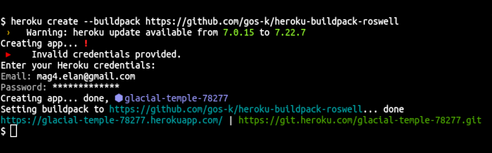

# Webアプリの本番環境へのデプロイ

この章では第3章で作った地名検索アプリ「yubin」をWebアプリケーションとして本番環境にデプロイする方法を紹介します。一つ目は仮想コンテナツール「Docker」を使ったデプロイ、もう一つはメジャーなPaaS (Platform as a Service) であるHerokuへのデプロイについて説明します。

## Webアプリの開発

### ClackベースのWebアプリ

Common LispでWebアプリを作るためにはいくつかの方法がありますが、現在ではClackを使うのが主流です。ClackとはさまざまなWebサーバーのインターフェイスを統一し、ソフトウェアのコードを変更することなく複数のWebサーバー上で動かすことができます。たとえば、開発環境ではピュアCommon LispのHunchentootを使い、本番環境ではより高速なWooを使うといったことが可能となります。

このClackをベースとしてWebフレームワークにはningleやCaveman2、Utopianなどがあります。長くなるためここではWebアプリの作り方は紹介しませんが、興味がある方はぜひ調べてみてください。この章では `app.lisp` のような一ファイルのClackアプリケーションを使います。

**app.lisp**

```common-lisp
(ql:quickload '(:ningle :cl-mustache :yubin) :silent t)

(defun render (template &optional context)
  (format nil "~
<!doctype html>
<html>
  <head>
    <meta charset='utf-8'>
    <title>yubin</title>
  </head>
  <body>
    ~A
  </body>
</html>"
          (mustache:render* template context)))

(defvar *app* (make-instance 'ningle:app))

(defun root-handler (params)
  (let ((postal-code (cdr (assoc "postal_code" params :test #'equal))))
    (if (stringp postal-code)
        (handler-case
            (render "〒{{postal-code}}は「{{place}}」です"
                    `(("postal-code" . ,postal-code)
                      ("place" . ,(yubin:get-place postal-code))))
          (error (e)
            (render (princ-to-string e))))
        (render "<form>
                   郵便番号: <input type='text' name='postal_code'>
                   <input type='submit'>
                 </form>"))))

(setf (ningle:route *app* "/") #'root-handler)

*app*
```

このClackアプリを動かすには `clackup` コマンドを使います。`clackup` コマンドがない場合は `ros install clack` をしてClackをインストールしてください。`clackup` を実行してしばらく待ち `Listening on localhost:5000` と表示されれば起動完了です。ブラウザで `http://localhost:5000` を開くと郵便番号の入力フォームが表示されます。

```bash
# インストール
$ ros install clack
# Webサーバー起動
$ clackup app.lisp
Hunchentoot server is going to start.
Listening on localhost:5000.
```

### Qlotでの依存ライブラリ管理

Webアプリを本番環境にデプロイするときに問題となるのが、依存ライブラリのバージョン管理です。開発環境と本番環境で同じバージョンのライブラリを使わなければ環境によって挙動の一貫性を保つことができません。複数人で開発する場合にも各人の環境でのバージョン統一が必要となりますし、自分一人の開発であったとしても同じマシンで複数のプロジェクトを扱うときにはプロジェクトごとに異なるバージョンを使うケースがよくあります。

Qlotは、プロジェクトごとにライブラリを管理するためのツールです。依存ライブラリの情報を `qlfile` に記載することでどの環境でも同じバージョンの依存ライブラリ群をインストールすることができます。

#### コラム: QlotとQuicklispの関係

Quicklispはライブラリのダウンロードとインストールを行うツールとして広く使われていますが、ユーザー単位でインストールされるのですべてのプロジェクトで共有されてしまいます。Qlotでは、このQuicklispをプロジェクトのディレクトリに個別にインストールして、それを切り替える仕組みとなっています。そういう意味では依存ライブラリの管理というより複数のQuicklispディレクトリの管理ツールと言えるかもしれません。

まずはいつも通りRoswellでQlotをインストールします。執筆時点のQlotのバージョンは0.9.9です。

```bash
$ ros install qlot
$ qlot --version
Qlot 0.9.9
```

利用するには `qlfile` を追加します。まずは空の `qlfile` を作り、 `qlot install` で依存ライブラリのセットアップをしましょう。

```bash
$ touch qlfile
$ qlot install
```

完了すると新しく `qlfile.lock` と `quicklisp/` ディレクトリが作られます。`qlfile.lock` は `qlfile` を元に必要なライブラリバージョンを解決した情報が含まれているので、必ずリポジトリに含めてください。`quicklisp/` ディレクトリは依存ライブラリのソースコードがダウンロードされているため、リポジトリに含める必要はありません。以下はgitリポジトリを使う場合の利用例です。

```bash
$ echo quicklisp/ >> .gitignore
$ git add qlfile qlfile.lock
$ git commit -m 'Start using Qlot.'
```

以降、 `qlot install` をするとどの環境でも同じバージョンの依存ライブラリ群がインストールできます。

QlotではQuicklispだけでなくgitリポジトリを指定してライブラリをインストールすることもできます。`qlfile` の一例を以下に示します。ブランチやタグを指定したり特定のコミットを指定したりもできます。詳しくはQlotのREADME[^qlot-readme]を参照してください。

**qlfile例**

```text
ql :all 2018-02-28                          # Quicklispの2018-02-28のdistを利用する
ql clack :latest                            # Clackのみ最新の登録バージョンを利用する
git lsx https://github.com/fukamachi/lsx    # LSXはgitリポジトリからダウンロードする
```

Qlotが有効な状態でCommon Lisp環境を起動するにはプロジェクトルートに移動し、実行コマンドの前に `qlot exec` をつけます。たとえばREPLを起動するには `qlot exec ros run` のようにします。LemでSLIMEを起動するときには `C-u M-x slime` を実行して `qlot/sbcl-bin/1.4.8` のように処理系名の前に `qlot/` がついたものを選択します。

QlotではRoswellスクリプトの対応もしています。qlfileによりインストールされる依存ライブラリのRoswellスクリプトは `.qlot/bin/` の下にインストールされます。たとえば `clack` の場合は `.qlot/bin/clackup` がインストールされます。このスクリプトの実行に限り `qlot exec` を省略してもQlotが有効な状態で実行されます。

```bash
# REPLを起動
$ qlot exec ros run
# Roswellスクリプトの実行
$ .qlot/bin/clackup app.lisp
```

依存ライブラリのバージョンを更新するには `qlot update` が使えます。実行すると `qlfile.lock` の内容が更新されます。

```bash
# すべての依存ライブラリを更新する (qlfile.lockを作り直す)
$ qlot update
# 特定のライブラリのみ更新する場合は --project を指定する
$ qlot update --project clack
```

## Dockerイメージとしてデプロイする場合

それでは仮想コンテナツールDockerを使ってマシンイメージを作る場合を説明します。Dockerを使えば同じマシンイメージをAWSやGCP、Azureのようなクラウドホスティングサービスにデプロイすることができます。

### Dockerfileを書く

まずはDockerを利用するためにはDockerfileというファイルを作ります。これはマシンイメージを作るための手順を記述したものです。ベースとなるDockerイメージを `FROM` に指定しています。Roswellが利用可能なDockerイメージは多くの人が独自に作ったものがいくつも乱立している状況で、どれを使うべきかは将来的に変わる可能性があります。ここでは40antsが提供するDockerイメージ[^40ants-docker-image]を使います。

**Dockerfile**

```dockerfile
FROM 40ants/base-lisp-image:0.6.0-sbcl-bin as base

COPY . /app
RUN qlot install
RUN qlot exec ros build roswell/yubin-server.ros

EXPOSE 5000
ENTRYPOINT ["qlot", "exec"]
CMD ["roswell/yubin-server"]
```

起動を早くするためにDockerイメージの作成時にアプリもビルドしてしまうよう、新たに `roswell/yubin-server.ros` というファイルを追加しています。内容を以下に示します。

**roswell/yubin-server.ros**

```common-lisp
#!/bin/sh
#|-*- mode:lisp -*-|#
#|
exec ros -Q -- $0 "$@"
|#
(progn ;;init forms
  (ros:ensure-asdf)
  #+quicklisp (ql:quickload '(:yubin :clack :clack-handler-woo) :silent t))

(defpackage :ros.script.yubin-server.3762644102
  (:use :cl))
(in-package :ros.script.yubin-server.3762644102)

(defvar *app*
  (clack:eval-file
    (asdf:system-relative-pathname :yubin #P"app.lisp")))

(defun main (&rest argv)
  (declare (ignorable argv))
  (clack:clackup *app*
                 :server :woo
                 :address "0.0.0.0"
                 :port 5000
                 :debug nil
                 :use-thread nil))
;;; vim: set ft=lisp lisp:
```

これらのファイルをyubinのリポジトリに作ります。このDockerfileからDockerイメージを作るにはDockerfileがあるディレクトリ――ここではリポジトリルート――で `docker build` を行います。コンパイルがあるためやや時間がかかります。しばらく待ちプロセスが終了したら準備完了です。`docker run` を行うとDockerイメージを起動できます。

```bash
$ docker build . -t yubin
$ docker run -it -p 5000:5000 yubin
```

`Listening on localhost:5000` と表示されたら起動完了です。

実際にクラウドホスティングサービスへデプロイする手順はCommon Lispに限定されないため割愛します。利用したいそれぞれのサービスのドキュメントをご覧ください。

- AWS Elastic Beanstalk: https://docs.aws.amazon.com/ja_jp/elasticbeanstalk/latest/dg/single-container-docker.html
- Google Compute Engine: https://cloud.google.com/compute/docs/instance-groups/deploying-docker-containers?hl=ja

## Herokuにデプロイする場合

もう一つの例として代表的なPaaSの一つであるHeroku[^45152b661534ef52c557094b671f9876]にデプロイする方法について説明します。
Herokuのアカウント作成[^heroku-signup]やコマンドインストール[^heroku-cli]に関しては、言語に関わらず共通のため省略します。

### 使い方

Herokuでは標準でCommon Lispをサポートしていないため、カスタムビルドパックとして `heroku-buildpack-roswell`[^git-buildpack-roswell]を使用します。

```bash
$ heroku create --buildpack https://github.com/gos-k/heroku-buildpack-roswell
```

実行するとEmailとPasswordを要求されるので、事前にアカウント作成した時のものを入力してください。



ここで作成されたアプリケーション名は `glacial-temple-78277` で
Webサービスが公開されるアドレスが `https://glacial-temple-78277.herokuapp.com` となり、
自分が開発したWebサービスを登録するためのgitリポジトリが `https://git.heroku.com/glacial-temple-78277.git` となります。

これらはheroku createの度に変わりますので、それぞれの環境に合わせて適宜読み替えてください。

```bash
$ git clone https://git.heroku.com/glacial-temple-78277.git sample
Cloning into 'sample'...
warning: You appear to have cloned an empty repository.
$ cd sample
```

`sample` ディレクトリが作成されるので、ここにWebサービスを開発します。
今回はWebフレームワークとしてClackを使用し、そのサンプルにある文字列を返すだけのWebサービスを作成します。

まず、Heroku側でUTF-8を扱うため、環境変数 `LANG` を設定します。

```bash
$ heroku config:set LANG=ja_JP.UTF-8
```

最低限必要なファイルは次の4つです。

- `.roswell-install-list`
- `.roswell-load-system-list`
- `app.lisp`
- `Procfile`

`.roswell-install-list` の内容は次の通りです。
これは `clackup` コマンドを使用するために、対象のパッケージをインストールします。

```text
clack
clfreaks/yubin
```

`.roswell-load-system-list` の内容は次の通りです。
これは対象のパッケージをロードを行いキャッシュファイルを生成します。
ここで必要なパッケージが指定されていない場合、起動時にコンパイルが発生した結果、タイムアウトエラーとなる場合があります。

```text
clack
ningle
cl-mustache
yubin
```

`app.lisp` の内容は、先ほどの物と同様です。

`Procfile` の内容は次の通りです。
ここにはサービス起動時に実行されるclackupコマンドを記述します。
`$PORT` はHeroku側から渡されるポート番号で、Heroku内部での通信に使用されます。

```text
web clackup --port $PORT app.lisp
```

これらのファイルを追加およびプッシュすると、コンパイルが行われサービスがデプロイされます。

```bash
$ git add .roswell-install-list .roswell-load-system-list app.lisp Procfile
$ git commit -m "Initial commit"
$ git push
```

初回は処理系やQuicklispのダウンロードも行われるので、プッシュに伴うHeroku側でのリモート実行により、終わるまでに数分を要します。

```text
Counting objects: 3, done.
Delta compression using up to 4 threads.
Compressing objects: 100% (3/3), done.
Writing objects: 100% (3/3), 276 bytes | 276.00 KiB/s, done.
Total 3 (delta 2), reused 0 (delta 0)
remote: Compressing source files... done.
remote: Building source:

... (中略) ...

remote: -----> Discovering process types
remote:        Procfile declares types -> web
remote: 
remote: -----> Compressing...
remote:        Done: 66.6M
remote: -----> Launching...
remote:        Released v6
remote:        https://glacial-temple-78277.herokuapp.com/ deployed to Heroku
remote: 
remote: Verifying deploy... done.
To https://git.heroku.com/glacial-temple-78277.git
   9b50d39..2adaacd  master -> master
```

`deployed to Heroku` にあるアドレスからWebサービスにアクセスできます。
(この例では `https://glacial-temple-78277.herokuapp.com/`)
Webブラウザでアクセスし、郵便番号を入力するページが表示されればデプロイ成功です。

動作しなかった場合には、`heroku logs --tail` とするとHeroku側のログを見る事が出来ます。

[^heroku-signup]: https://signup.heroku.com
[^heroku-cli]: https://devcenter.heroku.com/articles/heroku-cli
[^git-buildpack-roswell]: https://github.com/gos-k/heroku-buildpack-roswell
[^qlot-readme]: https://github.com/fukamachi/qlot
[^40ants-docker-image]: https://github.com/40ants/base-lisp-image
[^45152b661534ef52c557094b671f9876]: https://jp.heroku.com
