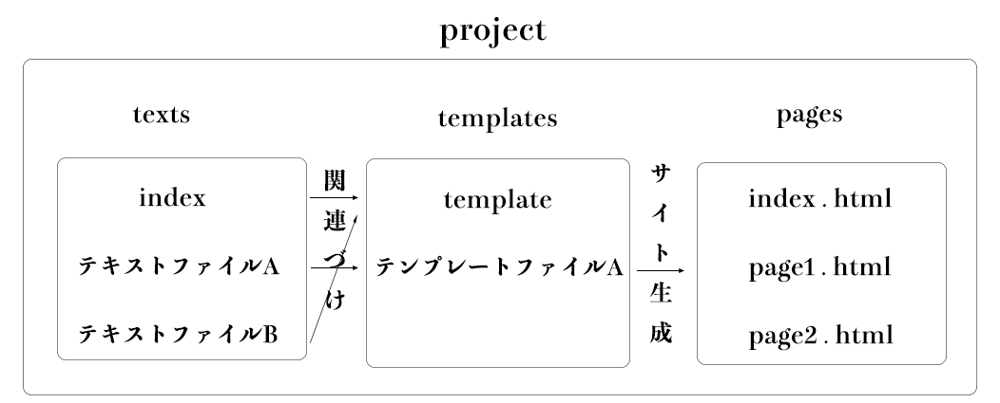
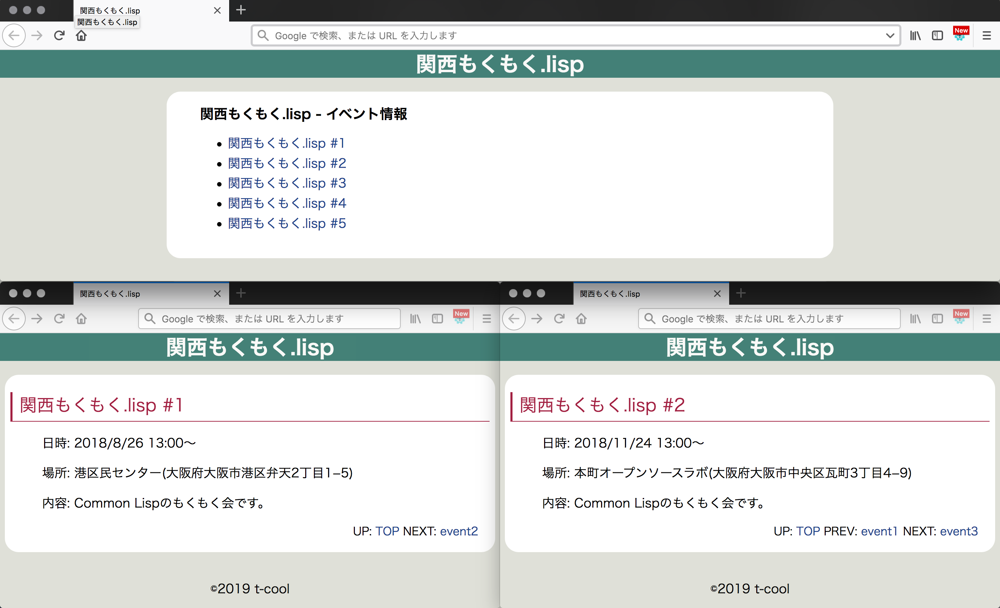
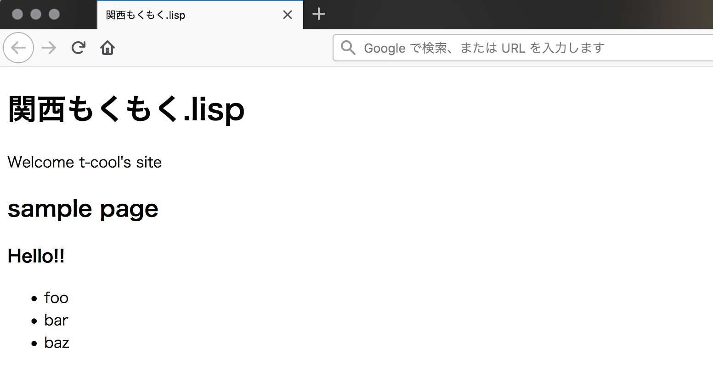

# プロジェクト例2: 静的サイト生成 atsuage 

atsuageは、Common Lispで実装された静的サイト生成システムです。

本章では、atsuageの使い方と実装についてみていきます。

## インストール

まず、Roswellでatsuageをインストールします。

```
# 依存ライブラリRosaのインストール
$ ros install t-sin/rosa

# atsuageのインストール
$ ros install myaosato/atsuage
```

インストールが完了すると、atsuageコマンドが使えるようになります。


## サイト構築の全体像

atsuageが管理するWebサイトの単位をプロジェクトと呼びます。atsuageでは、textsフォルダ内のテキストファイルと、templatesフォルダ内のテンプレートファイルを関連づけて、Webサイトを構築します。



## イベント情報サイトの作成

では、イベント情報サイトを構築しながら、atsuageの利用方法をみていきましょう。

完成後、Webサイトは次のようになります。



### プロジェクトの作成

まず、eventsという名前でプロジェクトを作成します。プロジェクトを生成するとき、サイト名と作者名の入力を求められます。ここでは、サイト名を`関西もくもく.lisp`、作者を`t-cool`としてプロジェクトを生成します。

```
$ atsuage new-project events
site-name: 関西もくもく.lisp
author: t-cool
```

コマンドの実行後、次のようにeventsディレクトリが作成されます。

```
$ tree events/
events/
├── .atsuage     (プロジェクトの設定ファイル)
├── pages        (HTMLが出力されるディレクトリ)
├── templates    (テンプレートファイル用のディレクトリ)
│   └── template (テンプレートファイル)
└── texts        (テキストファイル用のディレクトリ)
    ├── index    (indexファイル)
    └── project  (プロジェクトの情報が書かれたファイル)    
```

### Webページを書き出す

プロジェクトを作成したとき、2つのテキストファイル(`index`と`project`)とテンプレートファイル(`template`)が生成されます。まず試しに、これらのファイルからWebサイトを書き出してみます。atsuageでWebサイトを書き出すには、`atsuage refresh`コマンドを使います。`atsuage refresh`は、設定ファイルの情報にもとづき、テキストファイルとテンプレートからWebサイトを書き出すコマンドです。

```
$ atsuage refresh 
```

pages以下にindex.htmlが作成されるので、ブラウザで開いて確認してください。



### デフォルトで生成されるファイルの中身

デフォルトでは、2つのテキストファイル(`index`と`project`)は次のようになっています。

```
$ cat texts/index  
:TITLE sample page  
:DATE  
:PARENT  
:PREV  
:NEXT  
:TEXT  
### Hello!!  
 
* foo  
* bar  
* baz  
```

```
$ cat texts/project  
:SITE-NAME 関西もくもく.lisp
:AUTHOR t-cool
```

indexは`index.html`の内容、projectはプロジェクト全体に共通する内容を表しています。デフォルトでは、indexの`:TITLE`はsample page、`:DATE`や`:PREV`等は空文字列です。`:TEXT`が複数行にわたるときには、`:TEXT`直後で改行します。

次に、デフォルトのtemplateのコードを見てみましょう。

```
$ cat templates/template  
(:html (:head (:title (get-value "site-name" "project")))  
       (:body (:h1 (get-value "site-name" "project"))  
              (:p "Welcome " (get-value "author" "project") "'s site")  
              (:h2 (get-value "title"))  
              (:main (get-value-as-md "text")))) 
```

テンプレートファイルは、HTML風のS式として記述します。`:html` `:head` `:body` `:h1` `:p`などは良いとして、`get-value`と`get-value-as-md`がatsuage用に追加された関数です。`get-value`はテキストファイルから指定されたラベルの値を取得して置き換えます。`get-value-as-md`は指定されたラベルの値をMarkdownからHTMLの形式に変換して置き換えます。

### イベント情報のテキストファイルの作成

イベント情報のテキストファイルを`event1`から`event5`まで5つ作成します。

`event2`は次のようになっています。`:PREV`と`:NEXT`で前のページと次のページを指定しています。

```
$ atsuage new event2
$ cat texts/hoge  
:TITLE 関西もくもく.lisp #2
:DATE 2018-11-24 
:PARENT
:PREV event1
:NEXT event3
:TEXT
### 関西もくもく.lisp #2
 
* 日時: 2018/11/24 13:00〜
* 場所: 本町オープンソースラボ(大阪府大阪市中央区瓦町3丁目4−9)
* 内容: Common Lispのもくもく会です。
```

### テンプレートファイルの作成

次に、テンプレートファイルを作成します。トップページ用のindexと、イベントページ用のeventを作成します。

トップページでイベント一覧を表示するために、デフォルトの`template`を編集します。

```
(:html &(:lang "ja")
 (:head 
  (:meta &(:charset "UTF-8"))
  (:meta &(:name "viewport" :content "width = device-width, initial-scale = 1, user-scalable = yes"))
  (:link &(:rel "stylesheet" :type "text/css" :href "css/style.css"))
  (:title (get-value "site-name" "project") " - " (get-value "title"))) 
 (:body 
  (:header &(:id "main-header") 
   (:h1 (:a &(:href "./index.html") (get-value "site-name" "project"))))
  (:main 
   (:header &(:id "article-header") 
    (:div &(:id "date") (get-value "date"))
    (:h2 &(:id "title") (get-value "title")))
   (:div &(:id "article-main")
    (:ul
     (collect art (get-value-as-list "child")
       (:li (:a &(:href (concat art ".html")) (get-value "title" art)) " # " art))))
   (:footer &(:id "article-header") 
    "UP: " (:a &(:href (concat (get-value "parent") ".html")) (get-value "parent"))
    " PREV: " (:a &(:href (concat (get-value "prev") ".html")) (get-value "prev"))
    " NEXT: " (:a &(:href (concat (get-value "next") ".html")) (get-value "next"))))
  (:footer &(:id "main-footer")
   (:div &(:id "copyright")
    "&copy;" (get-value "pubyear" "project") " " (get-value "author" "project")))))
```

次に、イベントページ用のテンプレートファイルを作成します。

```
(:html &(:lang "ja")
 (:head 
  (:meta &(:charset "UTF-8"))
  (:meta &(:name "viewport" :content "width = device-width, initial-scale = 1, user-scalable = yes"))
  (:link &(:rel "stylesheet" :type "text/css" :href "css/style.css"))
  (:title (get-value "site-name" "project") " - " (get-value "title"))) 
 (:body 
  (:header &(:id "main-header") 
   (:h1 (:a &(:href "./index.html") (get-value "site-name" "project"))))
  (:main 
   (:header &(:id "article-header") 
    (:div &(:id "date") (get-value "date"))
    (:h2 &(:id "title") (get-value "title")))
   (:div &(:id "article-main") (get-value-as-md "text"))
   (:footer &(:id "article-header") 
    "UP: " (:a &(:href (concat (get-value "parent") ".html")) (get-value "parent"))
    " PREV: " (:a &(:href (concat (get-value "prev") ".html")) (get-value "prev"))
    " NEXT: " (:a &(:href (concat (get-value "next") ".html")) (get-value "next"))))
  (:footer &(:id "main-footer")
   (:div &(:id "copyright")
    "&copy;" (get-value "pubyear" "project") " " (get-value "author" "project")))))```
```

### Webサイトの生成

テキストファイルとテンプレートファイルの関連づけができたので、Webサイトを生成しましょう。

```
$ atsuage refresh
```

pagesディレクトリに生成されたWebサイトを確認してください。


### 設定用ファイル

atsuageでは、プロジェクト全体にわたる設定は、設定用ファイル(.atsuage)に書きます。

```
$ cat .atsuage  
(:IGNORE ("project") 
 :TEXT-FORMAT (:DEFAULT (:TITLE "title" :DATE "" :PARENT "" :PREV "" :NEXT "" :TEXT "please write"))  
 :DEFAULT-TEMPLATES NIL)
 ```
 
このファイルは属性リスト(plist)の形式で記述します。

`:IGNORE`では、先程述べたHTMLファイルに変換しないファイルを指定します。ここでは、projectのみを無視する設定となっています。

`:TEXT-FORMAT`では、テキストファイルをatsuageの機能を用いて生成する際に、テキストファイルにどのようなラベルをどのような値で表示するかということが書かれています。new-projectによる生成では、`:TITLE`の内容が別の文字列になっていますが、テキストファイルをatsuageを用いて生成する際には、各ラベルの内容を指定することも出来ます。生成後に編集しても問題はありません。

`:DEFAULT-TEMPLATES`は、どのテンプレートファイルを用いてHTMLファイルを生成するかということをテキストファイル毎に指定すためのものです。ここでは、NILとなっていますが、`atsuage page`コマンドで、テキストファイルとテンプレートファイルを関連づけることで、設定が追加されます。


## 実装について

### システムファイル - atsuage.asd

```
(defsystem "atsuage"
  :version "0.2.0"
  :author "Satoaki Miyao"
  :license "MIT"
  :depends-on (:cl-fad :alexandria :local-time :cl-ppcre :rosa :cl-markdown :local-time)
  :components ((:module "src"
                :components
                ((:file "utils")
                 (:file "text")
                 (:file "files")
                 (:file "converter" :depends-on ("data"))
                 (:file "data" :depends-on ("files" "text" "utils"))
                 (:file "config" :depends-on ("files" "utils"))
                 (:file "theme" :depends-on ("utils"))
                 (:file "core" :depends-on ("files" "data" "converter" "config"))
                 (:file "atsuage" :depends-on ("core" "theme" "config")))))
  :description "Atsuage is simple static site generator")
```

### 依存ライブラリについて

atsuageで用いているCommon Lispライブラリについてみていきます。

[Alexandria](https://common-lisp.net/project/alexandria/draft/alexandria.html)は、汎用のユーティリティ・ライブラリです。

[cl-fad](https://github.com/edicl/cl-fad)は、ファイル・ディレクトリ操作のためのライブラリです。

[cl-ppcre](https://github.com/edicl/cl-ppcre)は、Perl互換の正規表現ライブラリです

[cl-markdown](https://github.com/gwkkwg/cl-markdown)は、Common LispでMarkdown形式を扱うためのライブラリです。

[Rosa](https://github.com/t-sin/rosa)は、プレーンテキストにタイトルや作成者などのメタデータを付与するためのマークアップ言語です。

local-timeは、日時の処理のためのライブラリです。


### 実装1

### 実装2

### 実装3


## まとめ

* まとめ1

* まとめ2

* まとめ3

* まとめ4
